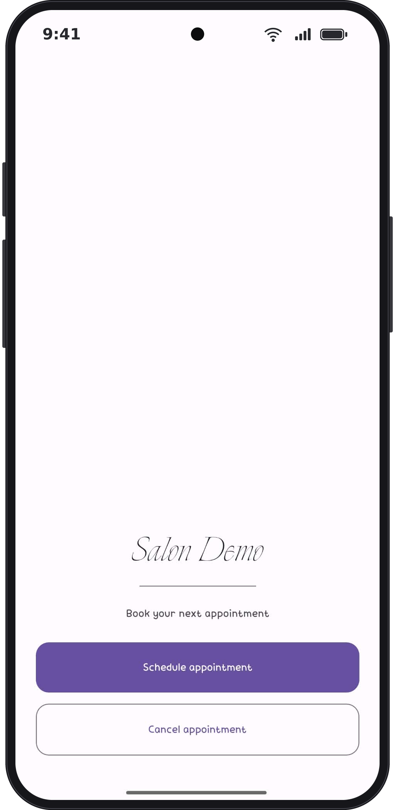
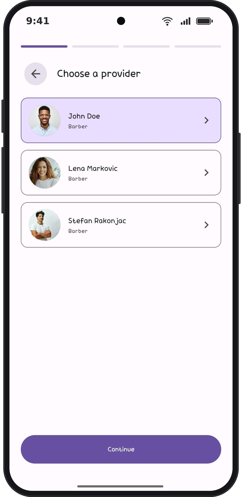
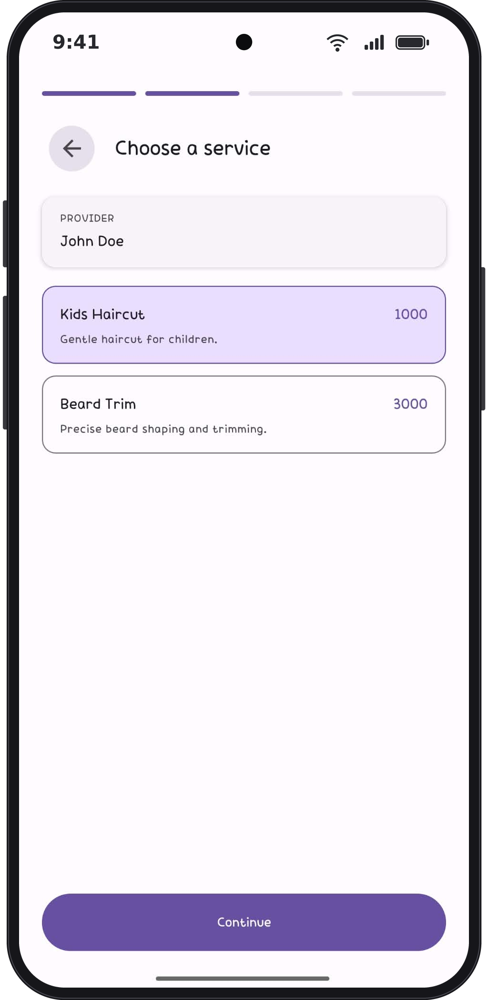
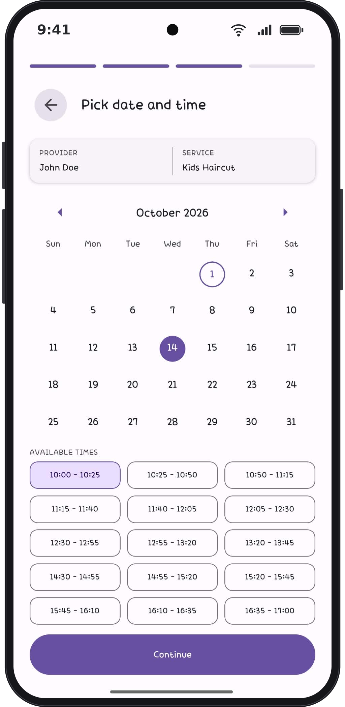
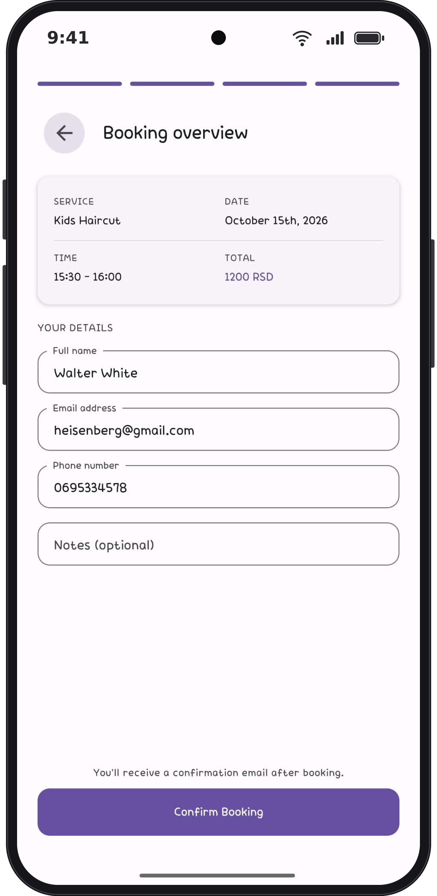
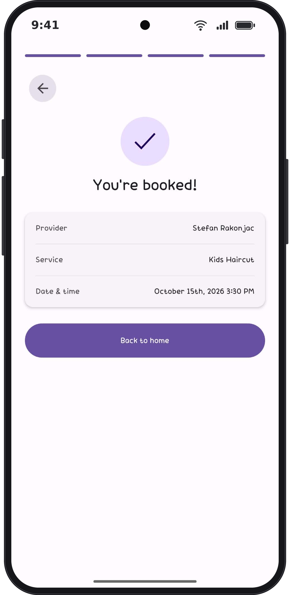

# Terminko Mobile

Guest mobile app for **Terminko**, a multi-tenant appointment scheduling platform
for small businesses (salons, barbers, dentists). Guests use it to book and
cancel appointments. Owners and staff use the web dashboard.

There is no public install yet. Run it locally with Expo Go.

> Backed by a Render-hosted API. The API sleeps after 15 minutes of
> inactivity, so the first request after a pause takes 30 to 60 seconds while
> the backend wakes up.

> **Part of the Terminko project:**
> - 🖥️ [terminko-server](https://github.com/xarambash/terminko-server): REST API
> - 🌐 [terminko-manager](https://github.com/xarambash/terminko-manager): Web dashboard ([live demo](https://terminko-manager.vercel.app/))
> - 📱 **terminko-mobile**: Guest app (this repo)

---

## Screenshots

<p align="center">
  <strong>Home</strong><br>
  
</p>
<p align="center">
  <strong>Provider</strong><br>
  
</p>
<p align="center">
  <strong>Service</strong><br>
  
</p>
<p align="center">
  <strong>Date and time</strong><br>
  
</p>
<p align="center">
  <strong>Booking overview</strong><br>
  
</p>
<p align="center">
  <strong>Confirmation</strong><br>
  
</p>

---

## Features

- Guest booking flow: provider, service, date and time, details, confirmation
- No account required. The salon is selected by tenant slug at build time
- Availability comes from the API, with unavailable days grayed out on the calendar
- Booking overview shows service, slot, and price before confirm
- Cancel an appointment with the cancellation code, no login required
- Salon name on the home screen is loaded from the API
- English UI through i18next

## Tech stack

| Area           | Choice                                      |
| -------------- | ------------------------------------------- |
| Language       | TypeScript 5                                |
| UI             | React Native 0.81, Expo 54, React Native Paper |
| Navigation     | React Navigation 7                          |
| State          | Redux Toolkit                               |
| HTTP           | axios                                       |
| Dates          | date-fns, react-native-calendars            |
| i18n           | i18next, react-i18next                      |
| Storage        | AsyncStorage                                |
| Tooling        | ESLint                                      |

## Running locally

```bash
git clone https://github.com/xarambash/terminko-mobile.git
cd terminko-mobile
cp .env.example .env
npm install
npm start
```

Then press `i` for the iOS simulator, `a` for Android, or scan the QR code
with Expo Go.

The app expects a running
[terminko-server](https://github.com/xarambash/terminko-server). On a physical
phone, `localhost` will not reach your computer. Use the Render URL from
`.env.example`, or your computer LAN IP.

| Script            | What it does                         |
| ----------------- | ------------------------------------ |
| `npm start`       | Start the Expo dev server            |
| `npm run ios`     | Open the iOS simulator               |
| `npm run android` | Open the Android emulator            |
| `npm run lint`    | Run ESLint                           |

### Environment variables

| Variable                   | Purpose                                      |
| -------------------------- | -------------------------------------------- |
| `EXPO_PUBLIC_API_URL`      | Base URL of the terminko-server API          |
| `EXPO_PUBLIC_TENANT_SLUG`  | Tenant slug the app should load              |

## Project structure

```
src/
├── api/          # axios calls, one file per domain
├── components/   # Shared UI and booking step layout
├── constants/    # Env and booking flow constants
├── i18n/         # i18next setup
├── locales/      # Translation files
├── navigation/   # Root stack
├── screens/      # Booking and cancel screens
├── store/        # Redux Toolkit slices and thunks
├── theme/        # Paper theme and brand tokens
└── utils/        # Small helpers
```

## Notes

This is a portfolio project. The backend runs on a free Render instance and
the database holds demo data only. Real user data is not stored.

There is no App Store or Play Store build. The guest flow is the product:
open the app, pick a provider, and book. Cancellation uses the code from the
confirmation step.

## What I'd do next

- Serbian locale next to English
- A public Expo build so the flow can be opened without a local checkout
- Tests for the booking steps and the cancel-by-code screen
- Reminder notifications before the appointment

## Author

Stefan Rakonjac, [@xarambash](https://github.com/xarambash)
